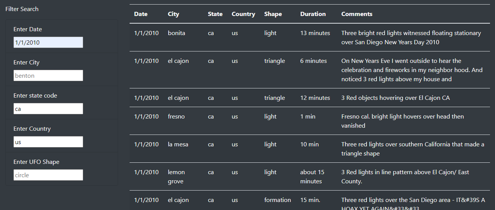

# UFO-sightings

## Purpose
The purpose of the project was to add a deeper filtering functionality to the UFO sighting data webpage. After completion of the project, users can now filter based upon date, city, state, country, shape of the sighted unidentified flying object. Additionally, instead of requiring users to push a button to filter, the filter will automatically update upon changing the filter text field. 

## Results
The webpage is fairly user friendly. Upon loading the page for the first time, the purpose of the page is displayed in the title and paragraph, and suggest search parameters are placed in the filter by default, but no filter is applied, the page looks like the following image:

In order to place filters on the data, all the user will need to do is type in the 'filter seach' text fields and click out of the field or press enter. The following image shows a filter looking for UFO sightings on 1/1/2010 in California. The other fields were not touched so they are not added to the filter.

## Summary
A drawback to this to this design, is that it cannot accept multiple, or a range of filter options in the same category (e.g. California, Arizona). Further development should include sizing for the html table that would better accomdate mobile, because the jumbotron and the paragraph are too small in mobile, and the page sizes to fit the table results. Additionally, including a way to filter at lease a range of dates would go a long way for functionality.
